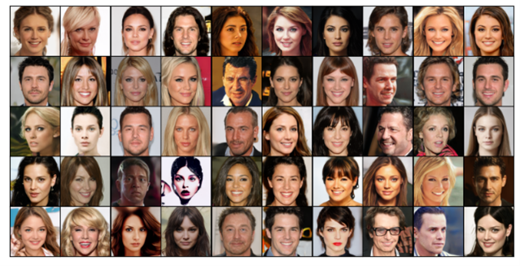
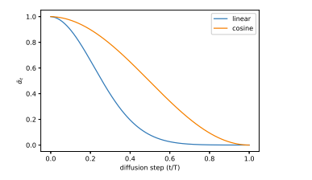
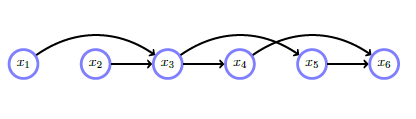
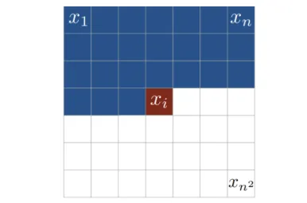
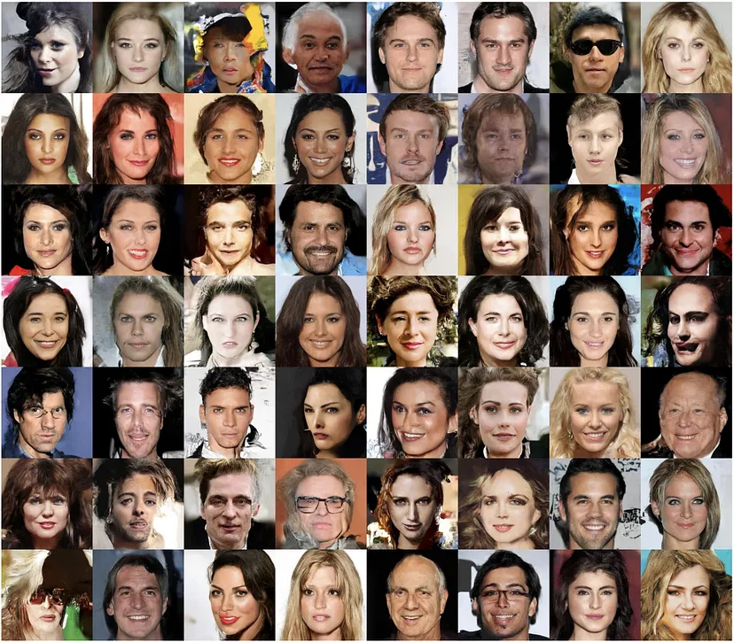
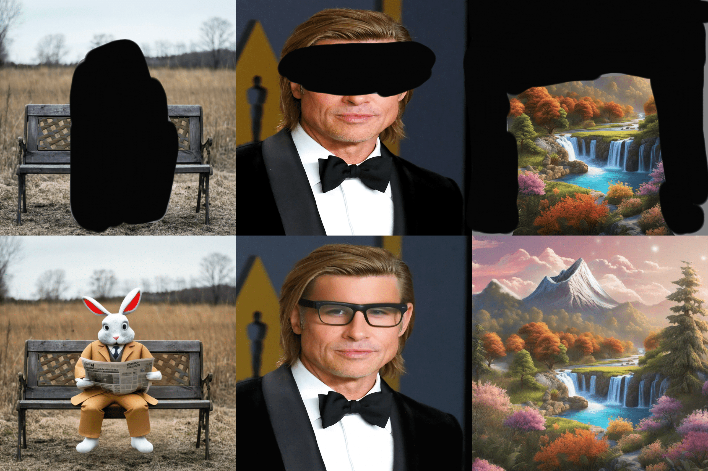
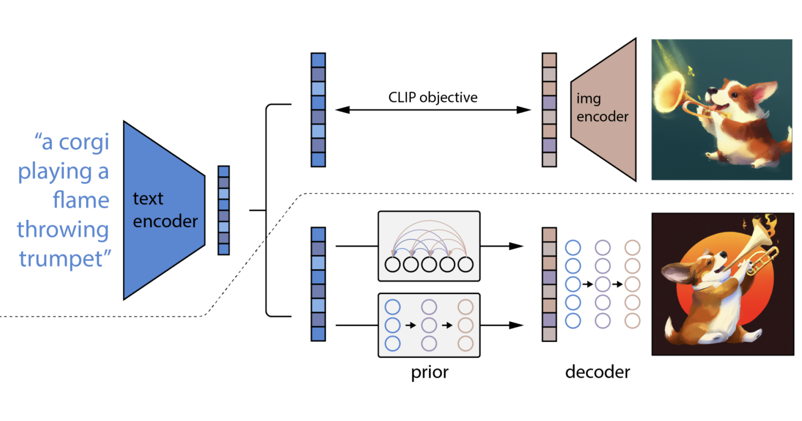

# Exploring Stable Diffusion Models: A Deep Dive into Generative Image Models

---

## Introduction to Diffusion Models

The idea of **diffusion** in machine learning is inspired by the physical process of particle diffusion. Diffusion models learn the data distribution by progressively denoising samples that start from a high level of random noise.

There are two parts to diffusion: 
1. **Forward Process**: Add noise incrementally to an image over several time steps, making it increasingly random.
2. **Reverse Process**: Learn to reverse this process and remove the noise step-by-step to recover the original image.

Mathematically, the forward process is generally modelled using a Gaussian noise distribution, and the reverse process is parameterized using deep neural networks. Gaussian noise is chosen due to the central limit theorem, that causes its occurance everywhere in nature. The reverse diffusion process gradually transforms random noise into an image.

### Forward Process

In a forward diffusion process, noise is slowly added to the data according to a predefined schedule. This can be described by the equation:

$$
q(x_t \mid x_0) = \mathcal{N}(x_t; \sqrt{\alpha_t} x_0, (1 - \alpha_t) I)
$$

where:
- $x_0$ is the original data point,
- $x_t$ is the noisy data point at time step $ t $,
- $\alpha_t$ controls the variance of the noise,
- $\mathcal{N}$ denotes a Gaussian distribution.

It is important to note that even though the schedule of the noise is fixed, the value of the noise we are adding is not. If we added the same noise to the image everytime, the DL model would learn this specific noise and overfit the data, reducing its genralizability.
The parameter $\alpha_t$ decides how quickly noise is added to the data. As $t$ increases, $x_t$ becomes more random, eventually approaching pure noise when $t$ reaches a maximum.

### Reverse Process

The reverse process tries to recover $x_0$ from a noisy version $x_T$ through a sequence of denoising steps. The reverse process is learned by training a neural network to predict the noise added at each step $t$, effectively denoising the sample. This is often formulated as:

$$
p_\theta(x_{t-1} \mid x_t) = \mathcal{N}(x_{t-1}; \mu_\theta(x_t, t), \Sigma_\theta(x_t, t))
$$

where:
- $p_\theta(x_{t-1} \mid x_t)$ represents the predicted data distribution at time $t-1$,
- $\mu_\theta(x_t, t)$ and $\Sigma_\theta(x_t, t)$ are the mean and variance predicted by the model (typically parameterized by a neural network),
- $\theta$ are the learned parameters of the network.

In this reverse process, the neural network is trained to generate progressively less noisy versions of the data as the time step $t$ decreases. Eventually, when $t = 0$, the model outputs a high-quality image $x_0$.

### Training

The diffusion model is trained to minimize a loss function that measures the difference between the predicted noise and the true noise added during the forward process. One commonly used loss function for this purpose is the mean squared error (MSE) between the predicted noise $\epsilon_\theta$ and the true noise $\epsilon$:

Here, $x_t$ is obtained from $x_0$ by adding noise according to the forward process, and $\epsilon_\theta$ is the neural network's prediction of the added noise. Note that the model is trained to predict the added noise, not the actual denoised image. Though the two tasks are mathematically equivalent (since it is possible to obtain either one from the other, given the target image), it was emperically seen that the model performs better if it is tasked to predict the noise.

## Stable Diffusion

**Stable Diffusion** specifically refers to models that maintain the stability of the denoising process by ensuring that the reverse diffusion does not diverge or introduce artifacts in the generated image. One way stable diffusion achieves this is by using carefully designed noise schedules, controlling how much noise is added and removed at each step. Stable diffusion also works with on a low-dimensional latent space, which reduces the computational cost and chances of image artifacts.

### Noise Schedule

Another part of stable diffusion is designing the noise schedule for both the forward and reverse processes. A typical noise schedule in stable diffusion models is a **linear variance schedule**, where the amount of noise added to the data increases linearly with time. This schedule is given by:

$$
\alpha_t = \alpha_0 + \frac{t}{T}(\alpha_T - \alpha_0)
$$

where $T$ is the total number of time steps and $\alpha_0$ and $\alpha_T$ represent the minimum and maximum noise levels.

Another commonly used noise schedule is the **cosine noise schedule**. With the cosine schedule the amount of noise increases more slowly at the beginning and end of the process, compared to a linear schedule.

$$
\alpha_t = \cos^2 \left( \frac{t/T + s}{1 + s} \cdot \frac{\pi}{2} \right)
$$

where:
- $t$ is the current time step,
- $T$ is the total number of time steps,
- $s$ is a small constant that adjusts the curvature of the cosine function (typically set to 0.008).

### Inference Process
Generally, the inference process is modelled as a markov chain and partially denoised images are fed into the model again for denoising.
Another popular method is **ancestral sampling**, where noise is added back to the partially generated image and it is denoised again. This helps to preserve fine details in the generated images. This also, however, leads to increased computational cost. A diagramatic representation of ancestral sampling is shown below:

---

## GANs (Generative Adversarial Networks)

Generative Adversarial Networks (GANs) are a class of generative models that have two neural models: a generator and a discriminator. The generator tries to create realistic images, and the discriminator predict whether the images are real or fake. Through this adversarial process, the generator learns to generate realistic images.

## Autoregressive Image Generation Models

Autoregressive models, like PixelCNN and ImageGPT, generate images by modeling the joint distribution of pixels as a sequence of conditional probabilities. Starting from the first pixel, the model generates one pixel at a time, generating each pixel by looking at the previously generated ones. These models are typically trained to predict the probability distribution of each pixel based on preceding pixels in a sequential order, similar to how ChatGPT generates entire sentences.

While autoregressive models generate highly detailed images and have stable training, they are  slow during the generation process because each pixel must be sampled sequentially, making them computationally expensive for high-resolution images.

## Advantages of Stable Diffusion Models

1. **High Quality of Generated Images**: By controlling the reverse diffusion process, SDMs generate images that are often sharper and more detailed than those produced by GANs.
   
2. **Improved Diversity**: Unlike GANs, which may suffer from mode collapse (generating the same image), diffusion models can produce a wide variety of images, because they sample from a learned probability distribution.
   
3. **No Adversarial Training**: GANs require adversarial training between a generator and a discriminator network, which is extremely unstable and difficult to tune. Diffusion models have a simpler loss function

## Applications of Stable Diffusion Models

Stable diffusion models have been applied to a wide range of tasks, like generative art, image synthesis, and content creation.

### Image Generation

One of the most prominent applications of stable diffusion models is image generation. By learning the underlying distribution of natural images, they can generate realistic images. These images can be targetted for certain attributes, such as text, allowing users to generate images of specific objects or scenes.

### Inpainting and Super-resolution

Stable diffusion models can also be applied to **inpainting**, where missing parts of an image are filled in, and **super-resolution**, where low-resolution images are converted to to higher-res images. This is useful in fields such as photo restoration and medical imaging.

### Text-to-Image Synthesis

Stable diffusion models images from text descriptions. This is achieved by conditioning the reverse diffusion process on textual inputs, allowing the model to produce images that match a given description. The CLIP model is used to generate numerical representations of the text input

---

## Challenges

1. **Computational Cost**: Training and inference in diffusion models is computationally expensive, requiring large amounts of computational resources, particularly for high-resolution images.
   
2. **Long Sampling Time**: The reverse diffusion process involves taking many steps to denoise an image, making inference slower than methods like GANs that generate images in a single forward pass. This is also a source of increased cost during inference.

3. **Hyperparameter Tuning**: Achieving stability in the diffusion process requires careful tuning of hyperparameters, such as the noise schedule and number of time steps.

---

### References
- https://www.superannotate.com/blog/diffusion-models
- https://lilianweng.github.io/posts/2021-07-11-diffusion-models/
- https://blogs.rstudio.com/ai/posts/2020-05-29-pixelcnn/
- https://neptune.ai/blog/generative-adversarial-networks-gan-applications
